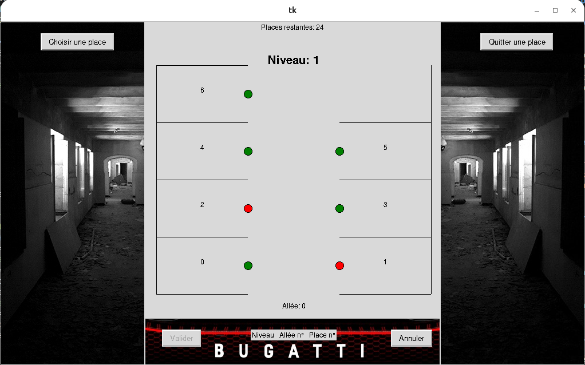

Voici un fichier README simple et structuré pour votre projet **Projet_parking_Python** :  

# Projet_parking_Python

## 📌 Description

Projet_parking_Python est une application simple permettant de configurer et de gérer un parking. L'utilisateur peut définir une configuration (niveaux, allées, places par allée), construire le parking, et utiliser un menu interactif pour simuler l'occupation des places en passant leur statut de **disponible (vert) à occupé (rouge)**.

## 🛠 Fonctionnalités

- Définition de la structure du parking (nombre de niveaux, allées, places).
- Construction du parking avec la configuration définie.
- Menu interactif permettant :
  - D'afficher l'état actuel du parking.
  - D'occuper une place (changer sa couleur en rouge).
  - De libérer une place (changer sa couleur en vert).
  
## 🚀 Installation et exécution

### Installation des dépendances
```bash
git clone https://github.com/gwendalauphan/Projet_parking_Python.git
cd Projet_parking_Python
conda create -n parking python=3.12
conda activate parking
pip install -r requirements.txt
```

### Lancer le programme
```bash
python3 main.py
```

### Désactiver l'environnement virtuel (optionnel)
```bash
conda deactivate
conda env remove -n parking
```

## ✨ Exemple d'utilisation

1. L'utilisateur définit une configuration de parking (ex: 2 niveaux, 3 allées par niveau, 10 places par allée).
2. Il lance le programme et utilise le menu pour simuler l'occupation des places.
3. Les places occupées passent en rouge, celles disponibles restent en vert.

## 📷 Screenshots



## 📌 Remarques

- Ce projet est un **exercice simple** de gestion de parking en Python.
- Il ne prend pas en charge les bases de données ni l'interface graphique.

